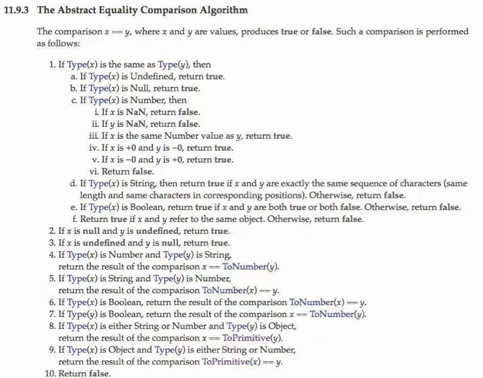
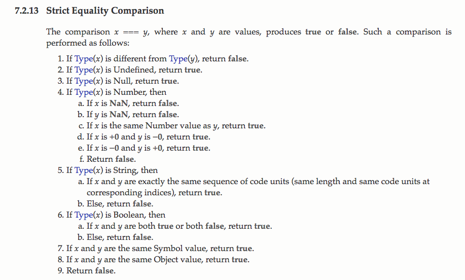
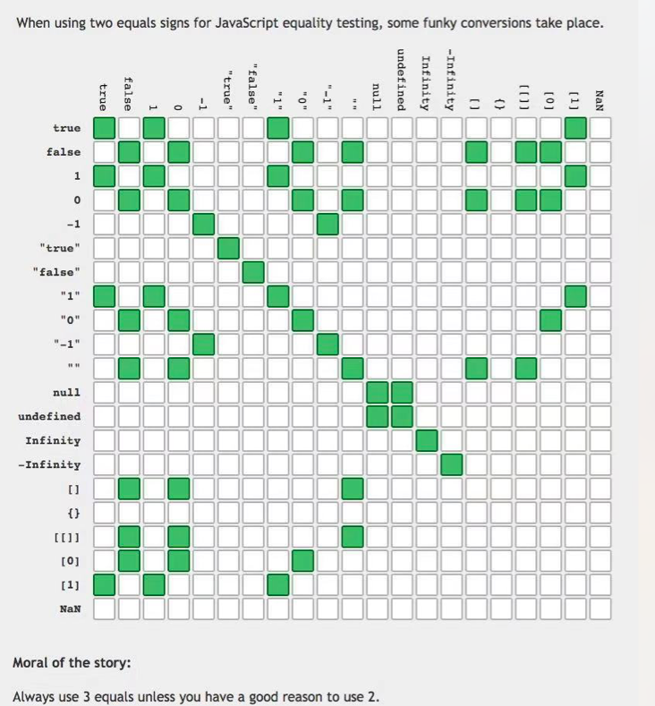

经典面试题，问起来这两者区别，更多的时候听到的回答是 === 是会比较类型， == 不会。不过进一步问 1 == [1]  返回 true  这是为什么呢？ 很多面试者就不知道怎么回答了。跟着问题，我们进一步了解下 == 和 === 的机制。 

以下是 == （Abstract Equality）比较的算法：

大致翻译如下：当比较 x == y的时候 ，如果 x，y是同类型：

 如果x，是 null 或者 undefined，返回 true

如果 x 是 NaN，返回 false（这就是为什么 NaN 永远不等于 NaN）

如果 x 和 y 数值相等返回 true

如果 x 是 +0 / -0 返回 true

如果 x 是字符串，x 和 y  必须完全吻合（包括字符顺序和字符串长度等）

如果 x 是 布尔型，x 和 y 需要都是 true 或者 false

如果 x ，y是不同类型

x 是 null / undefinde，y 是 undefined  / null，返回 true。因为undefined是从null派生出来的。

x / y 是 数字类型，y / x 是 字符串。那么要把 y / x (非数字转数字类型) 转换成 数字类型再做比较

x / y 是布尔型，要将 x / y 转换成数字类型进行比较

如果 x 或者  y 是 Object，要用 ToPrimitive（x 或者 y）[ 对与 ToPrimitive 函数 详细描述请参考 http://www.ecma-international.org/ecma-262/6.0/index.html#sec-toprimitive  简单浅显理解就是根据传入的参数的类型，来判断用toSring 还是 valueOf 进行转换] 转换后来进行比较。

最后 如果都不符合就返回 false

下面是‘===’比较 算法

例如如果  x === y 比较

x 和 y 类型不同，返回false

如果 x / y 同类型， x 是 null 或 undefined 返回 true

… 省略N多条，因为严格比较要比较类型和数值都相等，这里没什么特殊情况。

 

##### **个人理解:**

**1：比较 {} / [] 是要比较 {} / []的指针， 指针不一样 所以 [] == [] 和 {} == {} 都返回false；**

**2：如果和数字比较，所有类型都要转换成数字，然后进行比较；**

**3：对与只有一个元素的数组，先进行 [].toString()的转换，再进行比较，如 [1].toString() // '1',   然后比较 ‘1’ == true || ‘1’ == 1**

最后让我们来一个经典的图。

> PS： 面试时可能会碰见 类似的面试题，主要考察 js 类型的掌握程度，不求答案 100% 正确，因为在实际应用中绝大多数都用 ‘===’
