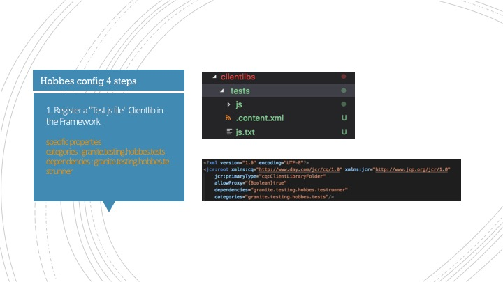
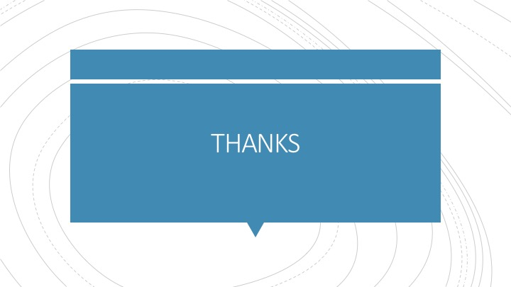

###### 记一次 aem test sharing。(AEM是一个庞大的，前后端未分离的，用java各种配置的框架。)  
###### 仔细查找文档发现了一些有助于 UI 测试的知识并记录。

##### 参考资料总结如下:   

###### https://blogs.perficient.com/2015/10/19/front-end-testing-with-hobbes-js/

###### https://helpx.adobe.com/experience-manager/6-3/sites/developing/using/reference-materials/test-api/hobs.actions.core.wait.html

###### http://www.6dglobal.com/blog/aem-hobbes-tests-a-head-start-2016-08-09

###### https://helpx.adobe.com/experience-manager/6-3/sites/developing/using/hobbes.html

