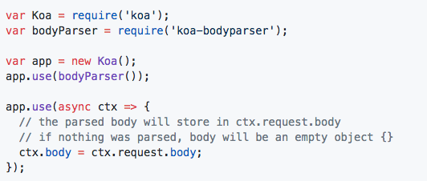
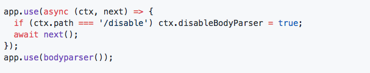
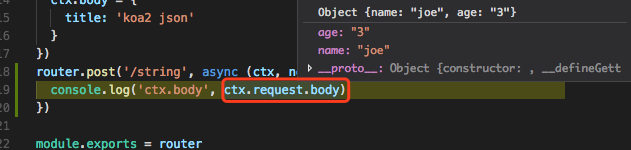
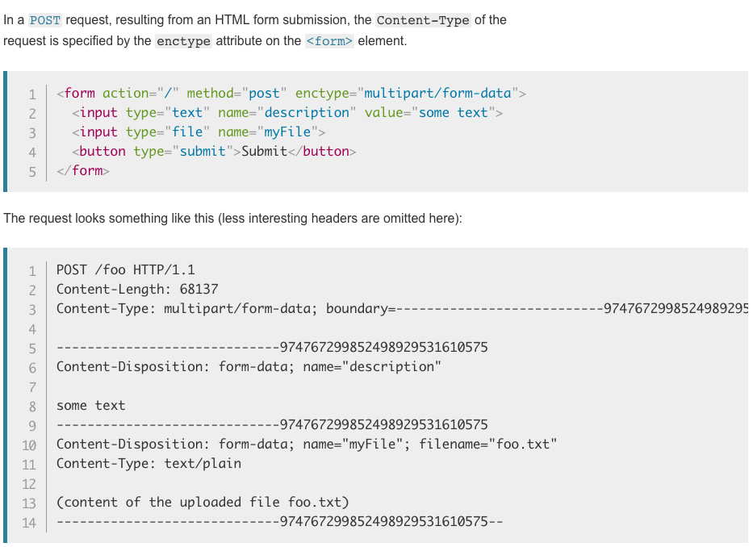
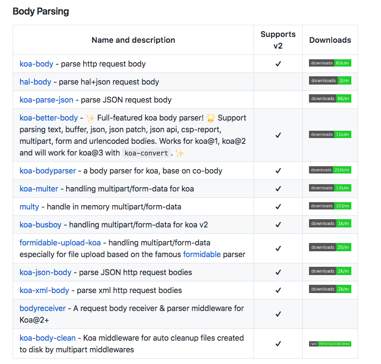

> koa中必不可少中间件之一  
A body parser for koa, base on co-body. support json, form and text type body.

#### **基本用法**

**disableBodyParser**: 可以动态的禁用 koa-bodyparser。

 

> 和co-body 、koa-body 功能类似，使用起来看喜好。都可以限制上传文件大小，可以限制传输请求格式enableTypes（json, form, text）,formLimit默认 **56kb**，jsonLimit 和 textLimit 都是 **1MB**。所以当我们上传表单时候，要控制下大小，如果超出限制，返回413错误。encoding默认为 utf-8。原始数据放在 cxt.request.rawBody 中，解析后的数据放在 cxt.request.body  中。本例中用postman（一个发送请求的工具）发起一个格式为 Json 的 post 请求。代码中是已经使用 koa-bodyparser 解析过的，直接返回给我一个object 方便使用。

（上图为使用 postman 发送请求）

（上图为服务器代码中解析后的结果）

 

——————————————— 相关知识分割线 ———————————————

emmm，看起来这个中间件极其简单呢，在看文档和demo过程中，对于 form-data 和 x-www-form-urlencorded 不太明白两者区别。其实 form 元素有个 enctype 属性，来指定数据编码方式：

**application/x-www-form-urlencoded:** 窗体数据被编码为名称/值对。这是标准的编码格式。当用get请求时，编码数据会以 & 符号分隔（类似 query ）写在url后。当发送post请求时，数据会放在 request body中；

**multipart/form-data:** 表单数据编码为一条消息，每个控件对应消息的一部分。一般用于上传图片、文件等 ；

**text/plain:** 表单数据以纯文本形式进行编码。

在developer.Mozilla.org 中关于 enctype = 'multipart/form-data' 的例子

关于 http header 的相关内容很多，在此不展开描述。

 

最后 Koa-bodyparser 简单且必要，相似的中间件有

（上图来自 https://github.com/koajs/koa/wiki#middleware）

大家可以根据需求选择一个合适的中间件。
