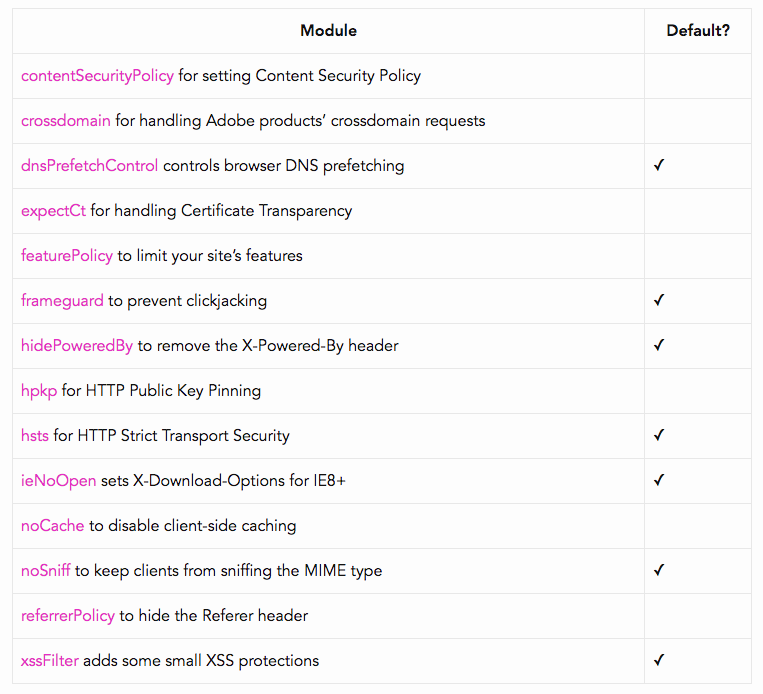
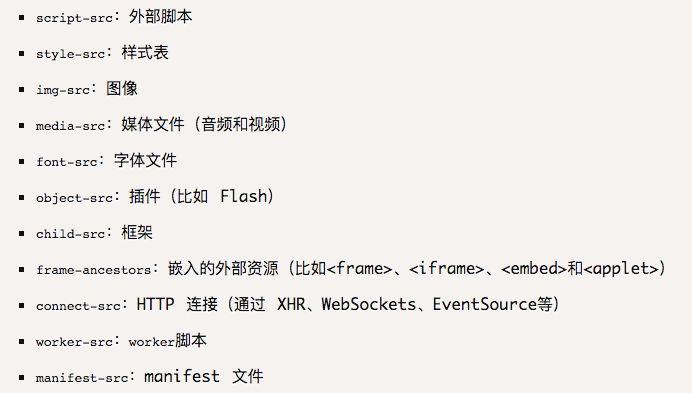
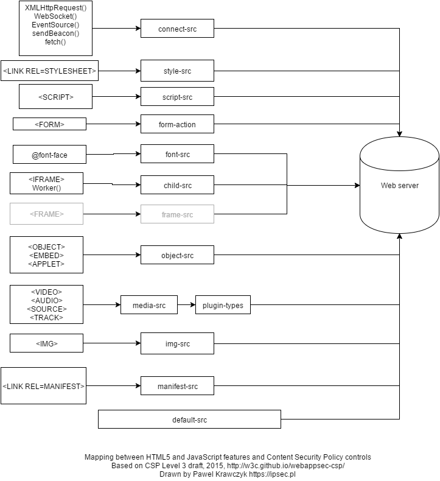
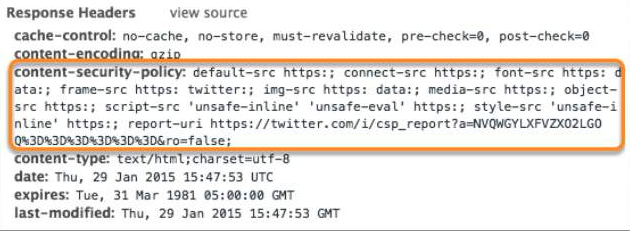
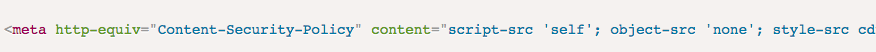

Koa-helmet 确保 koa 安全最强中间件！

官网: https://helmetjs.github.io/

无论前端还是后台，对安全都是极其重视的。前端同学在面试的时候常常被问到  XSS 黑客攻击手段。面试答案也很固定，其实安全防御的重点还是在服务器， koa-helmet 这个中间件能有效的防御 XSS 等攻击。这个中间件使用起来非常方便。Helmet 从14个方面守护着用户的安全，能抵挡大多数黑客攻击。本文简略的说明14种攻击类型，帮大家理解这个安全的中间件。

 

一:  **Content Security Policy（内容安全策略)**: 简称CSP，实质就是白名单制度，开发者明确告诉客户端，哪些外部资源可以加载和执行，等同于提供白名单。它的实现和执行全部由浏览器完成，开发者只需提供配置。

限制加载的类型及对应属性: 

 

**CSP对应关系图:**

 

#### 配置方法: 

**1.在http头中设置Content-Security-Policy字段**

**2.通过meta标签设置**

更详细介绍请参考阮大神文章: http://www.ruanyifeng.com/blog/2016/09/csp.html

 

二: **crossdomain** 针对Adobe的

详细内容请看这里 https://www.adobe.com/devnet/adobe-media-server/articles/cross-domain-xml-for-streaming.html  这个是用来确保 Flash player 从指定服务器的获取数据的安全等。

 

三: **dnsPrefetchControl ✓**

链接预取是一种浏览器机制，其利用浏览器空闲时间来下载或预取用户在不久的将来可能访问的文档。网页向浏览器提供一组预取提示，并在浏览器完成当前页面的加载后开始静默地拉取指定的文档并将其存储在缓存中。当用户访问其中一个预取文档时，便可以快速的从浏览器缓存中得到。虽然能起到一定的优化作用，但有用户可能泄漏自己的隐私信息。也有可能在用户不知情的情况下，偷偷自动访问另一个网站。

仅在 <link rel='dns-prefetch'  href='xxxxxx'/> 生效。 此中间件默认关闭连接预取。

 

四: **expectCt for handling Certificate Transparency**

Expect-CT 头允许站点选择性报告和/或执行证书透明度 (Certificate Transparency) 要求，来防止错误签发的网站证书的使用不被察觉。当站点启用 Expect-CT 头，就是在请求浏览器检查该网站的任何证书是否出现在公共证书透明度日志之中。

 

五: **featurePolicy to limit your site’s features**

Feature-Policy 打开或者关闭一些浏览器设备功能，比如全屏，付款，摄像等功能。而且这个功能会在潜入的iframe的网站依然生效。好在目前支持此功能的浏览器不多。不过还是要小心。

 

六: **frameguard to prevent clickjacking ✓**

使用 frame 嵌套一个网站，通过各种手段诱使受害人点击已经是一个最简单的攻击手段。我们可以通过X-Frame-Options 来控制嵌套 iframe 的类型（同源网站／禁止嵌套／制定网站嵌套）

 

七: **hidePoweredBy to remove the X-Powered-By header ✓**

**X-Powered-By** 用在服务器返回 http request 的 header 中，用来指明后台用的是什么技术。但这个正好可以被黑客用来确定服务器技术并选择攻击方式。此插件将这个字段抹去，来防止黑客轻易的获取服务器技术信息。

 

八: **hpkp for HTTP Public Key Pinning**

用来防范由「伪造或不正当手段获得网站证书」造成的中间人攻击

 

九: **hsts for HTTP Strict Transport Security ✓**

强制使用 https 协议访问当前资源。Https 相比 http 更安全。网站在http协议下更容易受到攻击。

 

十: **ieNoOpen sets X-Download-Options for IE8+ ✓**

禁止上传下载 html 文件／可执行文件。这个仅在低版本浏览器中有这个漏洞。

 

十一: **noCache to disable client-side caching**

防止用户拿到老版本的（有缺陷的）版本。

 

十二: **noSniff to keep clients from sniffing the MIME type ✓**

MIME sniff 原本是好意，浏览器会对文件进行嗅探，看看是否写错类型的是可执行文件。如果是照样执行。在上传和下载文件的时候，都会在header中表明文件类型（content-type），如: text/javascript, text/html等。但黑客会故意上传一个文件让浏览器自动下载执行。

 

十三: **referrerPolicy to hide the Referer header**

Referer header 会使网站知道用户是从哪里跳转而来。这也算用户隐私吧。

 

十四: **xssFilter adds some small XSS protections ✓**

这个令人头痛，网上85%的黑客攻击行为都是XSS攻击，相关知识就更多了，我们在另外的文章中对XSS展开讨论，这里就不赘述。

 

大家一起加油！
