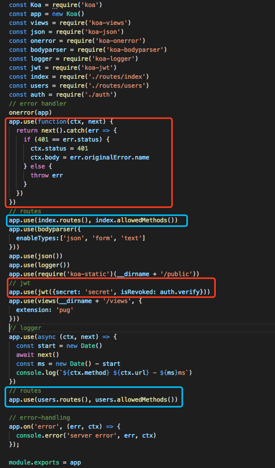
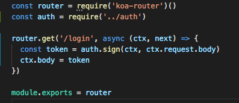
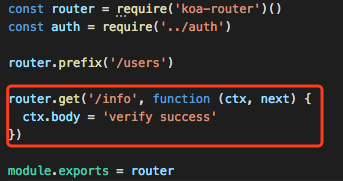
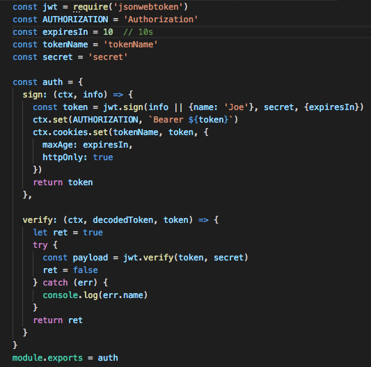
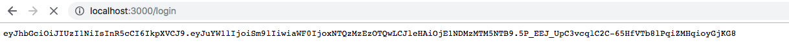
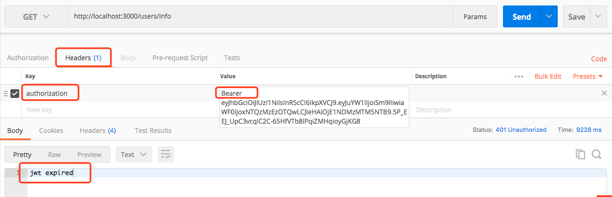
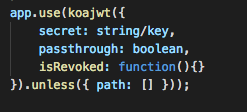
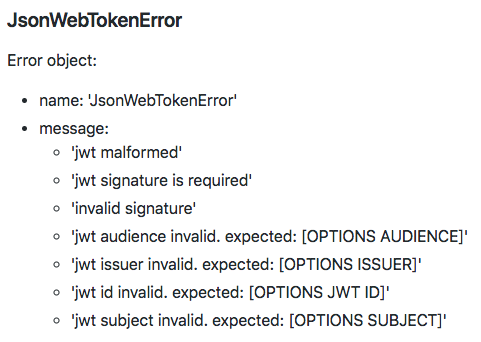
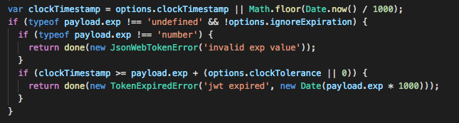

学习 Koa 不易，今天学习到了 koa-jwt 这个登陆验证必不可少的中间件。本文会说明 jwt是什么、token怎么来的、如何验证token。

一反常态，先上代码！(本代码由 koa-generater 生成，安装 koa-jwt,  jsonwebtoken 两个 npm 包 )

*文件名: app.js*



红色框：jwt 相关的代码

蓝色框：为了完成demo，在原有脚手架中做的调整。

 

*文件名: routes/index.js*



这里简单的模仿一个 login 请求，返回一个 token。

 

*文件名: routes/users.js*



users 以下的路由需通过 jwt 验证才能访问

*文件名: auth.js*



 
---
#### **思路及说明：**

1.我们在浏览器输入 [localhost:3000/login](localhost:3000/login) 获取 token。一下大串都是token，分为3部分，用 '.' 分隔；



2.这里用 postman 去访问 [localhost:3000/users/info](localhost:3000/users/info) 模拟访问用户数据。要在 header中加入 authorization, 注意：authorization的值的格式；



 

3.当输入 users 路由的时候 koa-jwt 不去验证 token 的正确性，仅仅去验证header中是否有 authorization 并且值为 'Bearer token'，然后再根据配置中 isRevoked 的函数去进行验证。isRevoked 返回 true 表明 token 不正确，false 表示 token 正确。

4.在验证中，使用  jsonwebtoken.verify 去验证 token 是否正确，并返回。

 
---
#### **API 解析：**

Koa-jwt：这个函数还是截图看得清楚



1.**secret**: 可以理解为一个加密因子，在生成 token 的时候用这个因子，验证 token 的时候也用同一个。Serect 可以是数组，当secret是一个数组时，在验证 token 时任何一个 因子通过验证，token就合法有效。

2.**passthrough**: 当为true时，即使在 header 中没有 authorization 也会通过这个 中间件（仅仅通过中间件的验证，没有通过 jsonwebtoken.verify）

3.**isRevoked**：需要一个函数来验证token的对错。这个函数有3个参数：ctx, decodedToken, token。其中 token 可以直接被验证： jsonwebtoken.verify(token)

 
---
#### **Jsonwebtoken:(这个才是主角！)**

jsonwebtoken.sign(payload, secretOrPrivateKey, [options, callback]) 生成 token

1.**payload** 是需要被加密的数据（我的理解 jwt其实就是加密解密和验证的过程）。在payload里有三个key很特别：iat（issued at）、exp（expiresIn）、nbf（notBefore），这几个参数推荐写在 options 中，不建议写在 payload 里；

2.**secretOrPrivateKey** 可以是字符串，也可以是对成加密的 key，或者非对称加密的私有key；

3.**options** 这里可以选择的参数就好多了，algorithms：加密算法，默认是HS256，expriesIn:token有效持续时间，notBefore: token在什么时候失效，更多参数请参考官网；

4.返回一个token。
 
---
#### **jwt.verify**
```js
jwt.verify(token, secretOrPublicKey, [options, callback])// 对token的验证
```

1.**token**: 当然是用 sign 函数生成的token啦；

2.**secretOrPublicKey**: 与生成 token 的加密因子相互对应，要么是相同的字符串和对称加密的key，或者是非对称加密的公有key；

3.**options**: 与 sign 相互照应且要一致。audience，issuer，jwtid等。

4.正确的时候返回 payload，错误的时候throw 一个 err，里面包含了错误的message，根据message判断错误类型。



 

**文档这里有个坑:**

**expiredIn**:默认单位是 **秒！！！** 以下是铁证啊（jsonwebtoken/verify.js ，这里是用秒做的对比，千万别以为是毫秒



 

> Tips: 通常情况下，我们也会在cookie里写一份token，这样每个请求都可以通过token验证，此时可以忽略 header中的autherization（passthrough: true）
