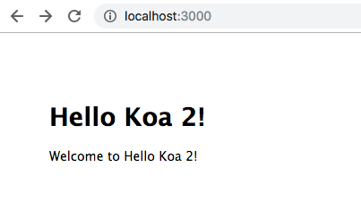
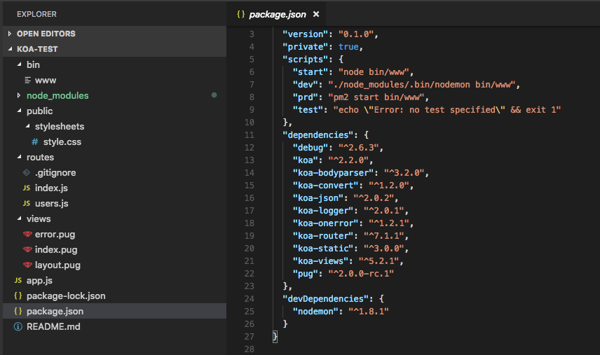
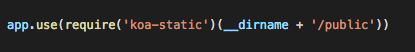
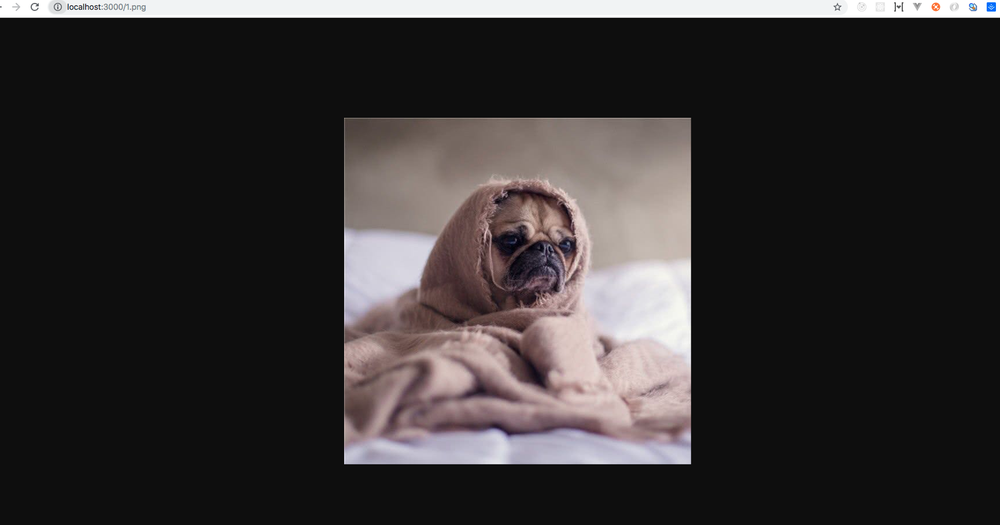

一直很想学后端技术，就是不知道如何提起兴趣，找到一个突破点。一日突然想从npm包和 koa 的中间件着手学习后端，看下后端同学思考和关心的点是什么。于是我就从npm包和中间件入手，来扒一扒后端的知识。Koa 是目前很火的 nodejs 框架，使用起来快捷方便。 如果懒的一点点窜架构，可以直接用  koa-generator脚手架很快就能搞到一个简易的框架。

 

##### 1.全局安装 koa-generator
```
npm install -g koa-generator
```
 

##### 2. 生成框架
```n
koa2 /yourFolder
```
 

##### 3.执行安装
```
npm install
```
 

##### 4.启动
```
npm start （npm start dev）
```
 

##### 5.查看

浏览器查看 localhost:3000 即可

 
效果图：



 

这一步完成的很easy，接下来我们看下目录结构。




这里koa-router 和 koa-static 已经创建完成，我们只需要根据业务扩展下即可。

---
**Koa-static**

超简单的一个中间件，目的是把服务器上的一个或者多个文件夹变成静态的，然后就可以开放给所有用户查看。

在代码中我们设置了



然后我们在public文件夹下放一张1.png图片， 并在浏览器中输入 localhost:3000/1.png



> 注意：在浏览器中输入地址时，不需要输入'public'，安装中间件加载顺序，先去找静态文件夹public中的文件，然后再匹配路由。
