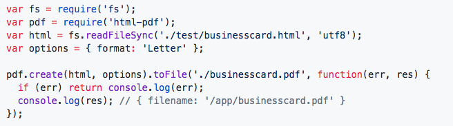
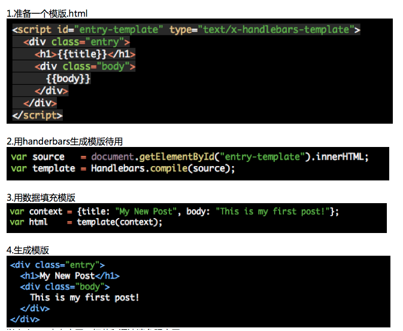
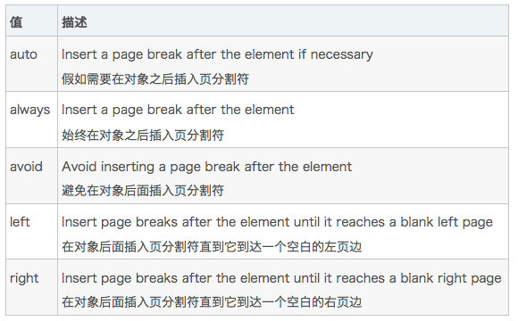

当当当，今天分享下如何生成pfd一个高效的解决方案。在管理系统中，我们需要将页面的内容打印 PDF 和 excel。HTML 打印 PDF 有很多方法，比如先将页面转换成canvas，然后打印canvas等。今天我们介绍2个 npm包，来帮助我们打印出来我们想要的PDF。其实打印pdf这个事儿主要工作在后端，众所周知前端能够做的东西有限，有限，，，

##### 思路

1.在页面上点击打印，把需要打印的内容传送给后台

2.在后端生成对应页面的template（或者是先生成好的）

3.向template中填充前端传来的数据

4.生成用数据的 HTML 页面并打印


### 一. handlerbars

*官网: http://handlebarsjs.com/*

用这个包让我们可以把我们想要打的页面模版化。用handerbars在后台生成一个供我们打印pdf的 pdf.html 模版（调整好样式），随时等着前端发送打印请求。

下面介绍下handlerbars的基本用法。



以上demo来自官网，细节和语法请参照官网。

#### **优点**
可以灵活的调整页面；可以注册函数，使用函数渲染列表；支持if／else渲染；如需要渲染图片，需用base64格式；学习成本低等

#### **缺点**
需要在后台重新写一套样式

---

二.node-html-pdf

Github: https://github.com/marcbachmann/node-html-pdf

又一个上手快的npm包，api简单明了,以下是核心代码


这里用到用 handerbars 生成的html，直接打印即可 。当然关于 pdf 页眉，页脚，缩放比例等的设置可以参考下 gitbub 里的说明。

以上两个npm包结合起来生成 pdf 再好用不过.

**PS：在生成打印 pdf 时，需用到分页打印。可用 page-break-before和page-break-after，这是CSS的一个属性哦,**
```js
<div style="page-break-before:always"></div>
```



