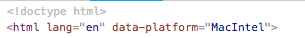

这是一个很蛋疼的问题，在window下会出现table出现滚动条，且把table-content的内容挤歪了，，，和浏览器无关，这个和操作系统有关系。网上有一些解决方案。在此不一一列举，或者写死columns的宽度，或者把滚动条width设置为0。不同的场景，需要调整的样式不同，所以在此仅总结相关知识。

 

#### 1.判断window系统


 

这个window对象通常我们都 navigator.userAgent 用来判断浏览器类型，例如
```js
//IE浏览器

if (userAgent.indexOf('NET') != -1 && userAgent.indexOf("rv") != -1) {

isIE = true;

/*broName = 'IE浏览器'; */

strStart = userAgent.indexOf('rv');

strStop = userAgent.indexOf(')');

temp = userAgent.substring(strStart, strStop);

broName = temp.replace('rv', 'IE').replace(':', '版本号');

}
```
此时我们用 platform 这个属性来判断电脑的操作系统

> Navigator.platform 的返回值 "MacIntel", "Win32", "FreeBSD i386", "WebTV OS"

>PS:  Most browsers, including Chrome, Edge, and Firefox 63 and later, return "Win32" even if running on a 64-bit version of Windows. Internet Explorer and versions of Firefox prior to version 63 still report "Win64". —- 来自Mozilla

所以我们判断 Win32 / Win64 就是 window操作系统， MacIntel 是 IOS 操作系统，"FreeBSD i386", "WebTV OS"分别是嵌入式和linux（这两个不是很确定，若有正确答案请留言）

技巧： 在 index.html / index.js 中写入 
```js
document.documentElement.setAttribute('data-platform', navigator.platform)，
```

html效果：



 

在css文件中 ，可以根据不同系统有不同表现：
```js
html[data-platform="Win32"] {
 color: red;
}

html[data-platform="MacIntel"] {
 color: blue;
}
```
     
#### 2.设置滚动条样式

**chrome（webkit)**

1. **::-webkit-scrollbar** 滚动条整体部分

2. **::-webkit-scrollbar-thumb** 滚动条里面的小方块，能向上向下移动（或向左向右移动）

3. **::-webkit-scrollbar-track** 滚动条的轨道（里面装有Thumb）

4. **::-webkit-scrollbar-button** 滚动条的轨道的两端按钮，由于通过点击微调小方块的位置。

5. **::-webkit-scrollbar-track-piece** 内层轨道，滚动条中间部分

6. **::-webkit-scrollbar-corner** 边角，即垂直滚动条和水平滚动条相交的地方

7. **::-webkit-resizer** 两个滚动条的交汇处上用于拖动调整元素大小的小控件

 

**sass写法**
```css
.scrollbarContainer {
    &::-webkit-scrollbar {
        background-color: red;
    }

    &::-webkit-scrollbar-track {
        background-color: blue;
    }

    &::-webkit-scrollbar-thumb {
        background: #3DB6A4;
    }

    &::-webkit-scrollbar-button:start {
        background-color: yellow;
    }

    &::-webkit-scrollbar-button:end {
        background-color: palevioletred;
    }
}
```

**IE （特殊的IE)**
```css
scrollbar-arrow-color: color; /*三角箭头的颜色*/

scrollbar-face-color:color; /*立体滚动条的颜色*/

scrollbar-3dlight-color: color; /*立体滚动条亮边的颜色*/

scrollbar-highlight-color: color; /*滚动条空白部分的颜色*/

scrollbar-shadow-color: color; /*立体滚动条阴影的颜色*/

scrollbar-darkshadow-color: color; /*立体滚动条强阴影的颜色*/

scrollbar-track-color: color; /*立体滚动条背景颜色*/

scrollbar-base-color:color; /*滚动条的基本颜色*/ 
```
